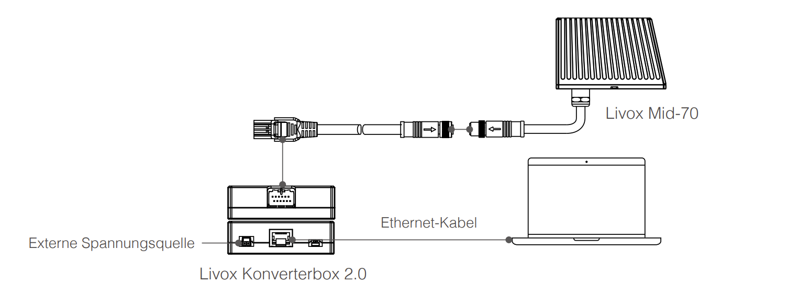

# Livox Mid-70开发文档

## 1.资料地址

```
#官网网址
https://www.livoxtech.com/cn
#资料下载中心
https://www.livoxtech.com/cn/downloads
#Livox-SDK Github文档
https://github.com/Livox-SDK/Livox-SDK
#Livox ROS2-driver文档
https://github.com/Livox-SDK/livox_ros2_driver
```

## 2.环境配置

Livox-SDK支持的Ubuntu版本为14.04、16.04、18.04。ROS2支持的版本为18.04。

### 2.1 ROS2-dashing-desktop安装

#### 2.1.1 设置编码语言区域

```
locale #查看是否有UTF-8编码格式，如果没有则按照下面的命令行代码设置

sudo apt update && sudo apt install locales
sudo locale-gen en_US en_US.UTF-8
sudo update-locale LC_ALL=en_US.UTF-8 LANG=en_US.UTF-8
export LANG=en_US.UTF-8

locale #验证是否设置好
```

#### 2.1.2 设置源

```
#添加ROS2 apt repositories
sudo apt update && sudo apt install curl gnupg2 lsb-release
sudo curl -sSL https://raw.githubusercontent.com/ros/rosdistro/master/ros.key  -o /usr/share/keyrings/ros-archive-keyring.gpg
#添加repository至sources list
echo "deb [arch=$(dpkg --print-architecture) signed-by=/usr/share/keyrings/ros-archive-keyring.gpg] http://packages.ros.org/ros2/ubuntu $(lsb_release -cs) main" | sudo tee /etc/apt/sources.list.d/ros2.list > /dev/null
```

#### 2.1.3  安装ROS2 package

```
#更新apt源
sudo apt update
#下载桌面版dashing
sudo apt install ros-dashing-desktop
#source进环境变量
vi ~/.bashrc
在最后一行添加入以下代码
source /opt/ros/dashing/setup.bash
#如果没有下载vim插件，可以用以下代码进行安装
sudo apt-get install vim-gtk
```

#### 2.1.4 样例测试

```
ros2 run demo_nodes_cpp talker
ros2 run demo_nodes_py listener
```

#### 2.1.5 添加参数自动补全插件argcomplete

```
sudo apt install -y python3-pip
pip3 install -U argcomplete
```

### 2.2 colcon 安装

```
sudo apt install python3-colcon-common-extensions
```

### 2.3 Livox-SDK安装

#### 2.3.1 cmake安装

```
#如果Ubuntu环境中没有cmake或者cmake版本低于3.0.0，则需要用以下命令进行安装
sudo apt install cmake
```

#### 2.3.2 Livox-SDK directory 下载、编译

```
git clone https://github.com/Livox-SDK/Livox-SDK.git
#如果没有git，通过以下命令进行安装
sudo apt-get install git
#如果上面代码下载很慢或者报错，大概率是github网站被防火墙墙了，需要挂代理，可以通过以下代码进行挂代理
git clone https://ghproxy.com/https://github.com/Livox-SDK/Livox-SDK.git
#编译Livox-SDK
cd Livox-SDK
#因为Jetson NX是ARM架构，所以需要采用交叉编译方式
#如果没有交叉编译工具链，可以通过以下命令进行下载
sudo apt-get install gcc-aarch64-linux-gnu g++-aarch64-linux-gnu
#编译
build && \
cmake .. -DCMAKE_SYSTEM_NAME=Linux -DCMAKE_C_COMPILER=aarch64-linux-gnu-gcc -DCMAKE_CXX_COMPILER=aarch64-linux-gnu-g++ -DCMAKE_DEPENDENT_CODE=ON
#上面编译指令加上了-DCMAKE_POSITION_DEPENDENT_CODE=ON是非常重要的，否则后续ROS2的编译会报错
make
#将编译后的静态库等文件安装到系统中
sudo make install
```

### 2.4 Livox-ros2-driver驱动文件安装

```
#git克隆仓库,在home目录底下进行clone
git clone https://github.com/Livox-SDK/livox_ros2_driver.git ws_livox/src
#编译
cd ws_livox
colcon build
#在上述的colcon build过程中需要用到一下的python包，如果没有需要手动安装，否则会报错
pip install empy
pip install lark
pip install numpy
#在运行ROS2程序时，需要将install/setup.sh添加入环境变量
source ~/ws_livox/install/setup.sh
#上面命令是仅在当前命令行终端有效，如果需要永久配置也可以按照下面方式
vi ~/.bashrc
在最后一行添加
source ~/ws_livox/install/setup.sh
```

## 3.样例测试

### 3.1 硬件连接



以太网线连接到Jetson NX上即可

需要配置将Ubuntu系统网口配置成静态IP

通过ifconfig查看网口名称，这里是eth0

```
sudo ifconfig eth0 192.168.1.50
```

### 3.2 Livox SDK测试

```
cd Livox-SDK/build/sample/lidar
#下面的一串符号是它的Broadcast Code，通过扫描Livox背后的二维码得到，然后最后一位是附加号，Livox Mid-70是1
./lidar_sample -c "3GGDJB3001P8491" -l
#如果显示很多数据，就说明已经测试成功了，如果测试不成功，大概率是NX和Livox不在同一局域网上，Livox如果没有修改成动态IP，那么它的IP地址就是192.168.1.149，49是序列号中除了附加位后的最后两位，可以通过ping 192.168.1.149测试是否连通，如果实在ping不通可以将livox和nx连接到同一个路由器上，然后在路由器网关页面查看连接的设备，如果有显示一个ip为192.168.1.149的设备，那么这时候就能ping通了，然后再进行上面的测试即可
```

可以将序列号添加入代码中，从而不需要命令行手中输入序列号

```
vi ~/Livox-SDK/sample/lidar/main.c
#将序列号添加入下面即可
char broadcast_code_list[kMaxLidarCount][kBroadcastCodeSize]={
"0000000000000001"
}
#记得修改BROADCAST_CODE_LIST_SIZE，上面有几个序列号它的值就是多少
#define BROADCAST_CODE_LIST_SIZE 3
```

### 3.3 ROS2 测试

#### 3.3.1 修改config文件

```
cd ~/ws_livox/src/livox_ros2_driver/config
vi livox_lidar_config.json
#将序列号添加到broadcast_code中，同时将enable_connect修改为true
```

#### 3.3.2 修改livox_ros2_driver.cpp

```
cd ~/ws_livox/src/livox_ros2_driver/livox_ros2_driver
vi livox_ros2_driver
#修改第94行的user_config_path，将path_default修改为下述地址
"~/ws_livox/src/livox_ros2_driver/config/livox_lidar_config.json"
```

#### 3.3.3 运行livox节点测试

因为下载下来的launch文件都有问题，所以只能使用ros2 run <package><node>来运行程序

```
cd ~/ws_livox
colcon build
ros2 run livox_ros2_driver livox_ros2_driver_node
#运行rviz2查看点云图
rviz2
#添加pointcloud2点云图插件，将topic修改为/livox/lidar
#将frame_id修改为frame_default
```

